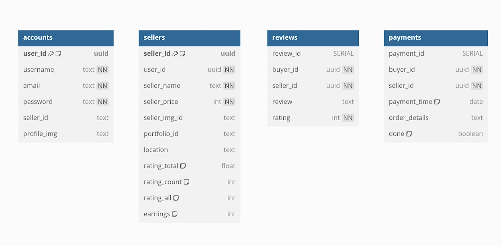
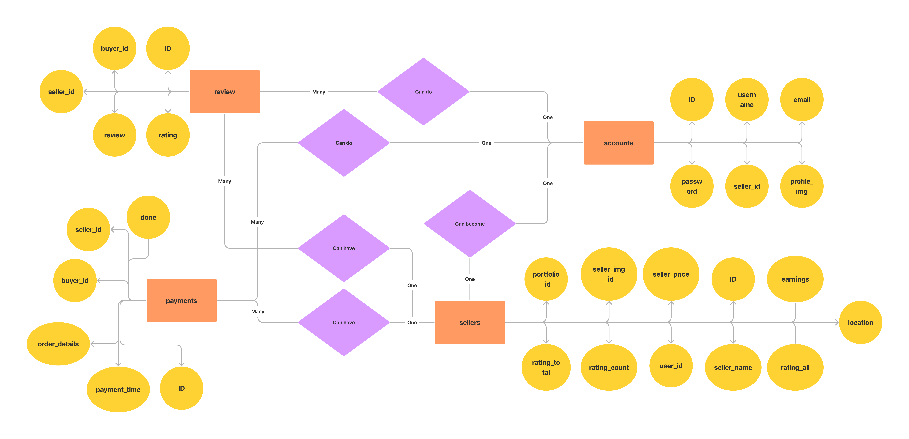
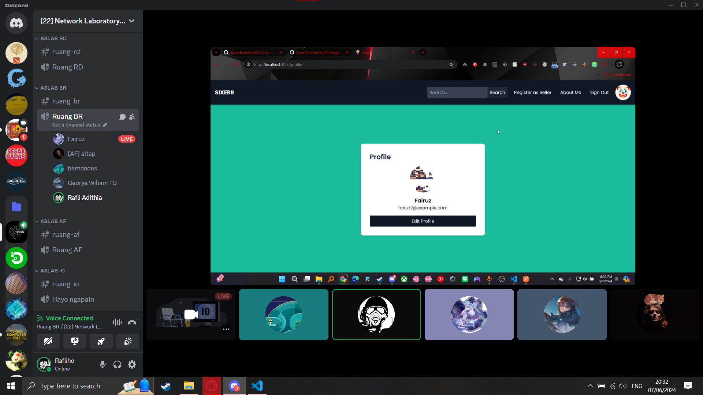
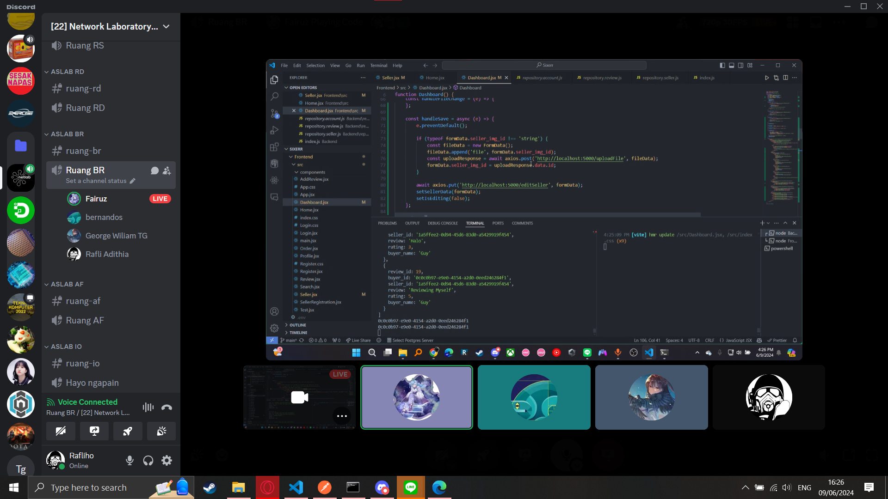

# SIXERR
Sixerr adalah sebuah aplikasi web sederhana yang terinspirasi dari Fiverr, dirancang untuk memfasilitasi interaksi antara penjual jasa (freelancers) dan pembeli jasa. Aplikasi ini menyediakan platform di mana penjual dapat menawarkan jasa mereka, dan pembeli dapat mencari serta mempekerjakan penjual berdasarkan kebutuhan mereka. Meskipun fiturnya lebih sederhana dibandingkan dengan Fiverr, aplikasi ini tetap menawarkan fungsi dasar yang penting untuk sebuah marketplace freelance.

# Diagrams
- UML  


- Flowchart  


- ERD  


# Installation Guide
- clone repository  
    ```
    git clone https://github.com/SistemBasisData2024/Sixerr
    ```
- buka terminal kedua dengan directory yang sama
## Backend
- masuk ke folder backend pada salah satu terminal
    ```
    cd Backend
    ```
- install semua dependencies
    ```
    npm install
    ```
- jalankan server Backend
    ```
    npm run start
    ```

## Frontend
- masuk ke folder frontend pada terminal yang lain
    ```
    cd Frontend
    ```
- install semua dependencies
    ```
    npm install
    ```
- jalankan client Frontend
    ```
    npm run dev
    ```

## Dokumentasi
- Meet Pertama

- Meet Kedua
